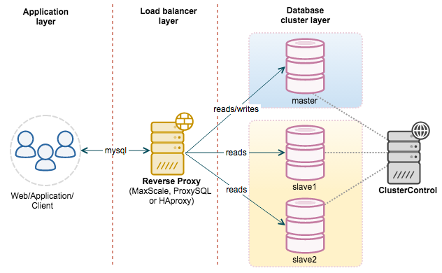

### mysql 主从同步

MySQL 主从同步主要涉及的就是主从的复制，主要涉及三个线程。binlog线程、I/O线程、SQL线程。

- binlog 线程 （binary log）：主要负责将主服务器上的数据写入二进制日志中。
- I/O 线程：主要是读取主服务器上的二进制日志并写入从服务器的中继日志中。（relay log）
- SQL线程：主要负责读取中继日志，解析出主服务器已经执行的数据更改并在从服务器中执行。

经常在读写分离的情况下用需要用到主从同步。主服务器负责写操作以及要求实时性比较高的读操作。从服务器主要负责读操作。

为什么读写分离能提高性能？

主从服务器可以各自负责读写，减轻了锁的争抢。从服务器可以使用MyISAM，提升了查询的性能以及节省了系统的开销。增加了冗余，提高了可用性。读写分离常用代理的方式去实现，代理服务器接受到应用层传来的读写请求，然后根据请求再决定转发到哪个服务器。

### redis 主从同步

redis 一个从服务器只能有一个主服务器，并且不支持主主复制。

连接的过程：

1. 主服务器创建快照文件，然后发送给从服务器。在发送期间，用缓存区存储主服务器执行的写命令。发送完毕后，开始向从服务器执行缓存区中的写命令。
2. 从服务器丢弃所有的旧数据，载入从主服务器发来的快照文件，之后从服务器开始接受主服务器发来的写命令。
3. 主服务器每执行一次写命令，向从服务器发送相同的写命令。

当负载逐渐上升时，主服务器可能无法很快的更新所有的从服务器。这个时候可以创建一个中间层来分代主服务器的复制工作。即中间层是上层的从服务器，是下层的主服务器。

